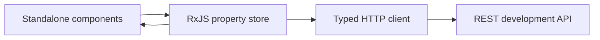

# Northstar Housing

A modern Angular property marketplace that demonstrates typed frontend architecture, RxJS state orchestration, REST integration, validated data-entry workflows, automated tests, and CI quality gates.

This repository began as an Angular 13 learning application. In August 2026, it was substantially modernized to Angular 22 and TypeScript 6. The commit history intentionally preserves that migration story.

## Engineering highlights

- Angular 22 standalone components and lazy-loaded routes
- Strict TypeScript models and typed reactive forms
- RxJS query orchestration with BehaviorSubject, combineLatest, switchMap, shareReplay, debounce, and resilient error states
- Typed HttpClient GET and POST operations behind a data-access service
- Local REST development environment powered by JSON Server
- Responsive, accessible listing, filtering, detail, and create-listing workflows
- Vitest unit tests and Angular HTTP testing
- GitHub Actions and Azure Pipelines build, test, formatting, and artifact stages

## Architecture



The UI never reads JSON directly. Components interact with the RxJS store or the typed API service, keeping presentation, query state, and data access separate. JSON Server is used only as a local REST simulator so the frontend can demonstrate realistic asynchronous GET and POST workflows without pretending that this repository contains a production backend.

## Features

- Search by listing name, city, province, or property type
- Filter by sale or rental, property type, bedrooms, and maximum price
- Sort by featured status, newest date, or price
- Detailed property views with amenities and availability
- Typed property-creation form with validation and observable submission handling
- Loading, empty, API failure, and not-found states
- Responsive layouts for desktop and mobile

## Run locally

Requirements:

- Node.js 24
- npm 11

Install the locked dependencies:

```bash
npm ci
```

Start the Angular application and local REST API together:

```bash
npm run dev
```

Open http://localhost:4200. The API runs at http://localhost:3000 and is proxied through /api during Angular development.

## Quality checks

```bash
npm run format:check
npm test
npm run build
```

The same commands run in GitHub Actions and Azure Pipelines. The Azure pipeline also publishes the production browser bundle as an artifact.

## Project structure

```text
src/app/core/models              Domain and filter types
src/app/core/services            REST client and RxJS state orchestration
src/app/property                 Feature components and workflows
server/db.json                   Local REST development data
.github/workflows/ci.yml         GitHub Actions quality gates
azure-pipelines.yml              Azure DevOps CI and artifact pipeline
```

## Defensible resume wording

**Northstar Housing Marketplace — Independent Angular Modernization**

Angular 22, TypeScript 6, RxJS 7, REST, Vitest, GitHub Actions, Azure Pipelines | Aug 2026

- Modernized a legacy Angular 13 property application to Angular 22 using standalone components, lazy-loaded routes, strict TypeScript models, and typed reactive forms.
- Implemented RxJS-driven search, filtering, sorting, refresh, and error-state orchestration using BehaviorSubject, combineLatest, switchMap, shareReplay, and debounced form streams.
- Built typed REST data access and property-creation workflows with Angular HttpClient, validation, route-based detail retrieval, and unit tests using Vitest and Angular HTTP testing.
- Added GitHub Actions and Azure Pipelines quality gates for locked dependency installation, formatting, automated tests, production builds, and artifact publication.

This is an independent engineering project. It should not be described as paid production Angular experience.
